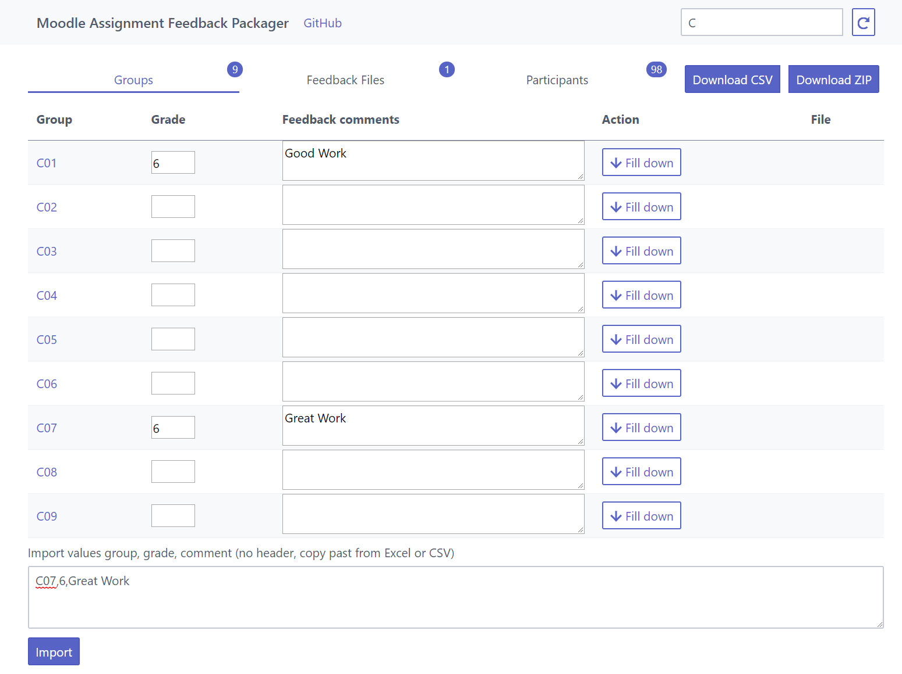

# Moodle Assignment Feedback Packager

> Create a offline assignment feedback zip fro moodle from csv and pdfs matched by groups.

## Demo

https://bfritscher.github.io/moodle-assignment-feedback-packager/

## Quick Start

0. Files can be provided on startup with ?url=http://linktofiletodonwload (pdf, zip, or json array with further links to pre provision the feedback).

1. Upload CSV from moodle assignments

2.
    - Set Grades by group or inidividualy
    - If required, upload files with group names

3. Export csv and zip with feedback file for each participant.

## Documentation
Moodle allows assignments and group assignments to be graded offline. This helps to assign a graded group work to each of its members, but also requires a special naming and formatting of files and csv content. To help, this small web app, helps to generate the offline grading zip and attribute a group grade to all its members. It only requires the initial offline grading worksheet and optionally a feedback file for each group.

### Getting the feedback file
1. The first step it to enable Feedback files and Offline grading worksheet in Moodle assignments ‘settings under Feedback Types.
2. It is then possible to use Download grading worksheet under View all submissions of the assignment.
3. This file can then be uploaded to the webapp: https://bfritscher.github.io/moodle-assignment-feedback-packager/

### Using the webapp

Screen after uploading a feedback file



- The first tab Groups helps to add feedback and grades to groups which are then copied to each member shown in the participants tab.

- On the bottom it is possible to import grades and comments based on the group key.

- The Feedback files tab allows to upload files if the filename has the name of a group it will be added to the feedback of each group member of this group.

- Finally, the updated csv file and packaged zip can be downloaded and uploaded to moodle’s assignment.


## FAQ

<dl>
  <dt>Are my files send to a server?</dt>
  <dd>No all is done locally in
your browser.</dd>
  <dt>Limitations?</dt>
  <dd>Browser's max size of files is arround 200MB</dd>
</dl>


## Build Setup

``` bash
# install dependencies
npm install

# serve with hot reload at localhost:8080
npm run dev

# build for production with minification
npm run build

# build for production and view the bundle analyzer report
npm run build --report
```

For detailed explanation on how things work, checkout the [guide](http://vuejs-templates.github.io/webpack/) and [docs for vue-loader](http://vuejs.github.io/vue-loader).
